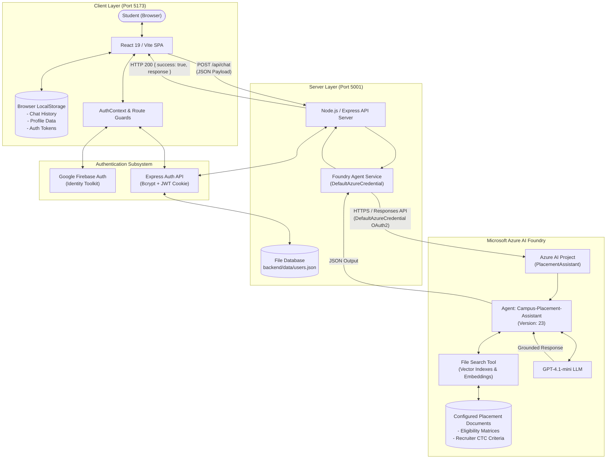

# Campus Placement Assistant

An AI-powered campus placement assistant designed to help students with placement-related information, eligibility evaluation, and preparation using Microsoft Azure AI Foundry, document-grounded retrieval (File Search RAG), and multi-turn conversational AI assistance.

---

## 1. Project Title

**Campus Placement Assistant**  
*An AI-driven institutional assistant connecting graduating university students to document-grounded placement intelligence, policy clarification, and technical preparation powered by Microsoft Azure AI Foundry.*

---

## 2. Team Members and Contributions

| Member | Designated Role | Primary Contributions |
| :--- | :--- | :--- |
| **Rudra** | Lead AI & Cloud Integration | Overall architecture, Microsoft Azure Foundry integration, Agent & File Search RAG setup, frontend/backend cloud integration. |
| **Pratham** | ML / Model Developer | Model training, dataset preparation, model evaluation, and ML component integration. |
| **Agrim** | Frontend Developer | React application structure, placement preparation views, UI design system, and component library. |
| **Natasha** | Authentication & User Flow | Firebase Authentication integration, login/signup interfaces, route guards, and user auth lifecycle. |
| **Kamaksha** | Chat, Storage & Testing | Chat window interface, LocalStorage conversation persistence, activity tracking, and automated testing suite. |

---

## 3. Problem Statement

University campus recruitment processes present significant challenges for graduating students:

- **Scattered & Inaccessible Placement Data**: Criteria, visiting schedules, and stipend/CTC details are often buried across disparate documents, departmental PDF circulars, and email threads.
- **Ambiguous Eligibility Policies**: Students struggle to calculate whether their current CGPA, backlog history, or academic branch satisfies specific recruiter requirements (e.g., Dream vs. Super Dream criteria).
- **Generic vs. Institutional Preparation**: Public generative AI models lack institutional knowledge and frequently hallucinate university placement rules, leading to misinformation.
- **Preparation Disconnect**: Students lack a unified workspace combining policy clarification, DSA preparation guidance, interview advice, and resume optimization tailored to campus hiring standards.

---

## 4. Solution Overview

The **Campus Placement Assistant** delivers an integrated, secure, and grounded AI assistant platform:

- **Conversational Placement Intelligence**: Dedicated conversational interface connected directly to the Microsoft Azure AI Foundry Agent `Campus-Placement-Assistant` (Version `23`).
- **Placement Knowledge**: Uses Microsoft Foundry File Search to retrieve relevant information from the placement documents configured for the agent.
- **High-Throughput Reasoning with GPT-4.1-mini**: Executes low-latency natural language generation adhering to strict knowledge boundary instructions.
- **Resilient Dual-Mode Authentication**: Supports Google Firebase Authentication (Email/Password) with automatic failover to a secure Node.js/Express JWT cookie session backend.
- **ChatGPT-Style Multi-Turn History**: Persists complete conversation sessions, automated title generation, and date grouping in browser LocalStorage.
- **Student Profile Management**: Enables students to maintain their active CGPA, backlogs, branch, and target roles to pre-populate personalized eligibility queries.

---

## 5. Solution Architecture & Data Flow



### Complete End-to-End Data Flow Lifecycle
1. **User Action**: Student inputs a query (e.g., *"What is the minimum CGPA requirement for Adobe recruitment?"*) in `<ChatInput>`.
2. **Client State Update**: `<App>` generates a unique message ID (`msg_<timestamp>_<rand>`), updates React state, saves the conversation to `localStorage` under `campus_placement_chat_history`, and displays a typing indicator.
3. **HTTP Transport**: `aiService.sendMessage()` issues an HTTP `POST` to `/api/chat` with `{ "message": "..." }`.
4. **Backend Processing**: `server.js` receives the request. In `backend/services/foundryAgent.js`, the query is wrapped with `KNOWLEDGE_BOUNDARY_INSTRUCTIONS`.
5. **Azure Authentication**: `DefaultAzureCredential` obtains an Azure Active Directory Bearer token.
6. **Agent & RAG Execution**: The `@azure/ai-projects` client calls Azure Foundry Responses API. The `Campus-Placement-Assistant` agent executes the **File Search** tool across indexed placement documents, retrieves relevant excerpts, and injects context into `gpt-4.1-mini`.
7. **Response Extraction & Render**: The grounded response text is returned as JSON `{ success: true, response: "..." }` to the frontend, appended to the chat state, saved to `localStorage`, and rendered via `<ReactMarkdown remarkPlugins={[remarkGfm]}>`.

---

## 6. Technology Stack

| Layer / Domain | Technology | Version | Purpose |
| :--- | :--- | :--- | :--- |
| **Frontend Framework** | React | `^19.2.8` | Declarative component UI library |
| **Frontend DOM** | React DOM | `^19.2.8` | DOM rendering layer for React 19 |
| **Build & Dev Tool** | Vite | `^8.3.0` | Ultra-fast development server & production bundler |
| **Routing** | React Router DOM | `^7.18.4` | Client-side declarative routing and protected route guards |
| **Iconography** | Lucide React | `^1.47.0` | Modern SVG iconography across navigation and components |
| **Markdown Parsing** | React Markdown | `^10.1.0` | Parsing and rendering AI responses with rich formatting |
| **Markdown Tables/Lists**| Remark GFM | `^4.0.1` | GitHub Flavored Markdown plugin for React Markdown |
| **Code Linting** | Oxlint | `^1.81.0` | High-performance static code analysis and rule enforcement |
| **Backend Runtime** | Node.js | `v18+` (Tested on v22) | Server execution environment |
| **Backend Framework** | Express | `^4.21.2` | REST API routing, middleware orchestration, and CORS handling |
| **Cloud AI Projects SDK**| `@azure/ai-projects` | `^2.7.0` | Microsoft Azure AI Foundry client SDK for Responses API |
| **Azure Identity SDK** | `@azure/identity` | `^4.13.0` | Passwordless Azure Active Directory credential acquisition |
| **OpenAI Client Bridge** | `openai` | `^6.16.0` | Official client bridge for responses and tool management |
| **Password Hashing** | `bcryptjs` | `^3.0.3` | Salted one-way cryptographic hashing for student passwords |
| **JWT Management** | `jsonwebtoken` | `^9.0.3` | Cryptographic signing and verification of session tokens |
| **Cookie Parsing** | `cookie-parser` | `^1.4.7` | Middleware for reading HTTP-only session cookies |
| **CORS Middleware** | `cors` | `^2.8.5` | Cross-Origin Resource Sharing with credentials allowlist |
| **Environment Config** | `dotenv` | `^16.4.7` | Loading environment configurations from `.env` files |
| **Cloud Authentication**| Firebase Web SDK | `^12.19.0` | Client-side Google Identity Toolkit authentication SDK |

---

## 7. AI Services and Models Used

- **AI Platform**: **Microsoft Azure AI Foundry** (Azure AI Projects)
- **Project Name**: `PlacementAssistant`
- **Project Endpoint**: `https://placementassistant.services.ai.azure.com/api/projects/PlacementAssistant`
- **Agent Name**: `Campus-Placement-Assistant`
- **Agent Version**: `23`
- **Foundation Model**: `gpt-4.1-mini`
- **Retrieval Tool**: **Azure File Search** (Server-side vector indexing and semantic chunk retrieval)
- **Integration SDK**: `@azure/ai-projects` with `@azure/identity`

### Knowledge Documents Connected in File Search
- `Chitkara_CSE_AIML_Canonical_Company_Data.md`
- `Chitkara_CSE_AIML_Eligibility_FINAL.md`
- `Chitkara_CSE_AIML_Placement_Facts_ONLY.md`

> *Note: Document contents are managed in Microsoft Foundry File Search and should be verified in the Foundry portal.*

---

## 8. Setup and Installation Instructions

### Prerequisites
1. **Node.js**: v18.0.0 or higher (v20+ recommended).
2. **Azure CLI**: Installed and authenticated with permissions for the Azure Foundry resource:
   ```bash
   az login
   ```
   Verify active subscription:
   ```bash
   az account show
   ```

### Step 1: Clone the Repository
```bash
git clone https://github.com/rudraarora12/campus-placement-assistent.git
cd Campus-Placement-Assistant
```

### Step 2: Configure Environment Files
Follow the template in [Section 9](#9-configuration-and-environment-variables) to create `backend/.env` and `frontend/.env`.

### Step 3: Install & Start Backend Server
```bash
cd backend
npm install
npm start
```
*Backend server runs on `http://localhost:5001`.*

### Step 4: Install & Start Frontend Application
Open a second terminal window:
```bash
cd frontend
npm install
npm run dev
```
*Frontend client runs on `http://localhost:5173`.*

### Step 5: Build for Production
To build the frontend production distribution:
```bash
cd frontend
npm run build
```

---

## 9. Configuration and Environment Variables

> **Security Note**: Never commit actual secrets or `.env` files to source control.

### Frontend Environment Variables (`frontend/.env`)
| Variable Name | Required? | Secret? | Purpose |
| :--- | :--- | :--- | :--- |
| `VITE_FIREBASE_API_KEY` | Yes | Public Client Config | Firebase Web API Key |
| `VITE_FIREBASE_AUTH_DOMAIN` | Yes | Public Client Config | Firebase Authentication Domain |
| `VITE_FIREBASE_PROJECT_ID` | Yes | Public Client Config | Firebase Project Identifier |
| `VITE_FIREBASE_STORAGE_BUCKET` | Yes | Public Client Config | Firebase Storage Bucket |
| `VITE_FIREBASE_MESSAGING_SENDER_ID`| Yes | Public Client Config | Firebase Cloud Messaging Sender ID |
| `VITE_FIREBASE_APP_ID` | Yes | Public Client Config | Firebase Web Application ID |
| `VITE_API_BASE_URL` | Optional | Public Client Config | Backend API Base URL (Default: `http://localhost:5001`) |

### Backend Environment Variables (`backend/.env`)
| Variable Name | Required? | Secret? | Purpose |
| :--- | :--- | :--- | :--- |
| `FOUNDRY_PROJECT_ENDPOINT` | Yes | Semi-Private | Azure AI Foundry Project endpoint URL |
| `FOUNDRY_AGENT_NAME` | Yes | Public Config | Azure Foundry Agent name (`Campus-Placement-Assistant`) |
| `FOUNDRY_AGENT_VERSION` | Yes | Public Config | Agent version reference (`23`) |
| `PORT` | Optional | Public Config | Express server port (Default: `5001`) |
| `JWT_SECRET` | Optional | **Secret** | Secret key for signing backend session tokens |

---

## 10. API Reference

| Method | Endpoint | Purpose | Auth Required | Request Body | Response Body / Status Codes |
| :--- | :--- | :--- | :--- | :--- | :--- |
| `POST` | `/api/chat` | Proxies student question to Azure Foundry Agent | No | `{"message": "string"}` | **200 OK**: `{"success": true, "response": "..."}`<br>**400**: Missing message<br>**500**: Azure credential/agent error |
| `GET` | `/api/health` | Backend and agent health verification | No | None | **200 OK**: `{"status": "ok", "agent": "...", "version": "23"}` |
| `POST` | `/api/auth/signup` | Registers new student in backend store | No | `{"name", "email", "password", "course", "branch", "graduationYear"}` | **201 Created**: `{"success": true, "user": {...}}` + Set-Cookie<br>**400**: Invalid password/fields<br>**409**: Duplicate email |
| `POST` | `/api/auth/login` | Authenticates student credentials | No | `{"email", "password"}` | **200 OK**: `{"success": true, "user": {...}}` + Set-Cookie<br>**401**: Invalid credentials |
| `POST` | `/api/auth/logout` | Clears active authentication cookie | No (Cookie) | None | **200 OK**: `{"success": true, "message": "Logged out"}` |
| `GET` | `/api/auth/me` | Validates session token & returns profile | **Yes** (Cookie) | None | **200 OK**: `{"success": true, "user": {...}}`<br>**401**: Not authenticated |

---

## 11. Testing and Actual Test Results

The backend includes a dedicated integration test suite in [`backend/test_auth.js`](file:///c:/Users/rudra/Desktop/Campus-Placement-Assistant/backend/test_auth.js) covering 9 automated scenarios.

### Running Automated Tests:
```bash
cd backend
node test_auth.js
```

### Actual Test Execution Output:
```text
--- STARTING COMPLETE AUTH & AI VERIFICATION TESTS ---

[TEST 1] Backend Health Check:                   Status: 200 OK (Agent & Endpoint verified)
[TEST 2] Signup with Weak Password:              Status: 400 Bad Request (Validation enforced)
[TEST 3] Signup with Valid Data:                 Status: 201 Created (User persisted, session cookie set)
[TEST 4] Duplicate Email Signup Rejection:       Status: 400 Bad Request (Conflict prevented)
[TEST 5] GET /api/auth/me (Session Check):       Status: 200 OK (JWT cookie authentication verified)
[TEST 6] Login with Invalid Password:            Status: 401 Unauthorized (Bcrypt comparison verified)
[TEST 7] Login with Valid Credentials:           Status: 200 OK (Session token issued)
[TEST 8] Logout:                                 Status: 200 OK (Session cookie cleared)
[TEST 9] Auth Check without Session:             Status: 401 Unauthorized (Access denied)

=========================================
ALL AUTHENTICATION TESTS PASSED SUCCESSFULLY! ✅
=========================================
```

### Manual Testing Checklist
- [x] **Signup**: Validates 8+ char password complexity (uppercase, lowercase, number) and registers account.
- [x] **Login**: Authenticates with valid email/password and redirects to `/assistant`.
- [x] **Logout**: Clears cookie session and redirects to `/login`.
- [x] **Route Guards**: Prevents unauthenticated access to `/assistant` and `/profile`.
- [x] **AI Chat**: Transmits question to `/api/chat` and renders formatted Markdown response.
- [x] **File Search**: Verifies grounded placement criteria citations for recruiter queries.
- [x] **Conversation History**: Generates automated topic title and persists multi-turn chat in LocalStorage.
- [x] **Persistence on Reload**: Restores active conversation and profile upon browser refresh.
- [x] **Conversation Deletion**: Removes specific conversation from LocalStorage on trash click.

---

## 12. Known Limitations

- **Browser-Specific History**: Chat conversations are stored in client-side LocalStorage and do not synchronize across different devices or browsers.
- **Document Boundary Dependency**: The assistant's knowledge is strictly bounded by the uploaded placement documents configured in Azure Foundry.
- **Local Development Scope**: The current server implementation is configured for local development and academic evaluation.

---

## 13. Future Improvements

- **Cloud Database Synchronization**: Integrate MongoDB Atlas or Azure Cosmos DB for cross-device conversation sync and centralized profile history.
- **Voice-Enabled Mock Interviews**: Integrate Azure Cognitive Speech Services for real-time conversational audio interview simulation.
- **Placement Cell Admin Portal**: Administrative interface for placement officers to upload and re-index new recruitment circulars dynamically.
- **Automated Resume Parsing**: Integrate Azure Document Intelligence to automatically extract student skills and CGPA from uploaded resume PDFs.

---

## 14. Third-Party Libraries, Services, and Resources Acknowledgement

We gratefully acknowledge the following open-source libraries and cloud services:
- **Microsoft Azure**: Azure AI Foundry, Azure AI Projects SDK, and Azure Identity for scalable cloud agent orchestration.
- **Google Firebase**: Firebase Authentication and Google Identity Toolkit for client-side authentication.
- **React & Vite Ecosystem**: React 19, Vite 8, React Router DOM 7, and Oxlint for the modern frontend architecture.
- **Lucide Icons**: Lucide React for consistent, high-quality SVG iconography.
- **Markdown Tools**: Unified, React Markdown, and Remark-GFM for secure and rich Markdown parsing.
- **Security Libraries**: `bcryptjs` and `jsonwebtoken` for cryptographic security and token management.

---

## 15. Responsible AI and Security Considerations

1. **Knowledge Grounding & Hallucination Mitigation**: Every prompt sent to the Azure Foundry Agent is wrapped in `KNOWLEDGE_BOUNDARY_INSTRUCTIONS`. If requested information is missing from the configured documents, the agent explicitly states: *"I couldn't find this information in the provided placement documents."*
2. **Out-of-Scope Query Handling**: The agent politely refuses off-topic queries (e.g. general trivia, sports, cooking) to remain a focused placement assistant.
3. **Server-Side Credential Isolation**: Azure Active Directory credentials are used strictly server-side via `DefaultAzureCredential`. No Azure tokens, tenant IDs, or private keys are exposed to the browser client.
4. **Password Security**: Passwords processed by the backend are hashed using `bcryptjs` with salt round 10 before storage. Plaintext passwords are never persisted.
5. **HTTP-Only Cookies & XSS Protection**: Session tokens are issued with `httpOnly: true` and `sameSite: 'lax'`, mitigating cross-site scripting (XSS) risks.
6. **Git Hygiene**: Sensitive files (`.env`, `.env.*`, `node_modules/`, `dist/`, `backend/data/*.json`) are excluded in [`.gitignore`](file:///c:/Users/rudra/Desktop/Campus-Placement-Assistant/.gitignore).

---

## 16. AI-103 Concepts Applied

| AI-103 Concept | Implementation in Project | Status |
| :--- | :--- | :--- |
| **Generative AI & LLMs** | `gpt-4.1-mini` utilized for high-throughput natural language placement guidance | **Applied** |
| **AI Agents** | Microsoft Azure AI Foundry Agent (`Campus-Placement-Assistant`, v23) with stateful reasoning | **Applied** |
| **RAG (Retrieval-Augmented Generation)** | Document-grounded retrieval using Azure File Search tool over vectorized placement circulars | **Applied** |
| **Knowledge Grounding** | Strict prompt engineering boundary preventing fabricated placement criteria and CTC figures | **Applied** |
| **Azure Identity & RBAC** | Passwordless cloud authentication utilizing `DefaultAzureCredential` | **Applied** |
| **Responses API** | High-level OpenAI Client bridge provided by `@azure/ai-projects` SDK | **Applied** |
| **API Integration** | Full-stack REST API bridge connecting React 19, Express 4, and Azure AI Projects | **Applied** |

---

## 17. Information Requiring Team Confirmation

The following items are designated for team confirmation and must be verified from team documentation:

- `[TEAM INPUT REQUIRED]`: Pratham's exact offline ML training algorithm and framework (e.g., PyTorch / Scikit-learn).
- `[TEAM INPUT REQUIRED]`: Offline training dataset name, sample count, feature list, and target variables.
- `[TEAM INPUT REQUIRED]`: Offline train/test evaluation metrics (Accuracy, Precision, Recall, F1 Score).
- `[TEAM INPUT REQUIRED]`: Saved offline model artifact format (`.onnx`, `.pt`, `.pkl`) and offline training environment.
- `[TEAM INPUT REQUIRED]`: Project presentation slide deck and video demonstration recording URL.
